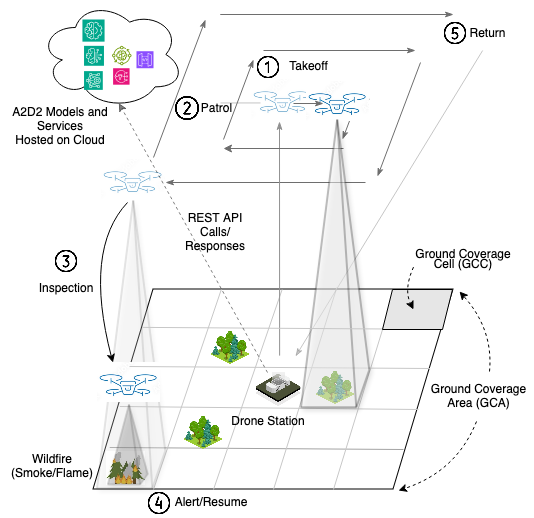
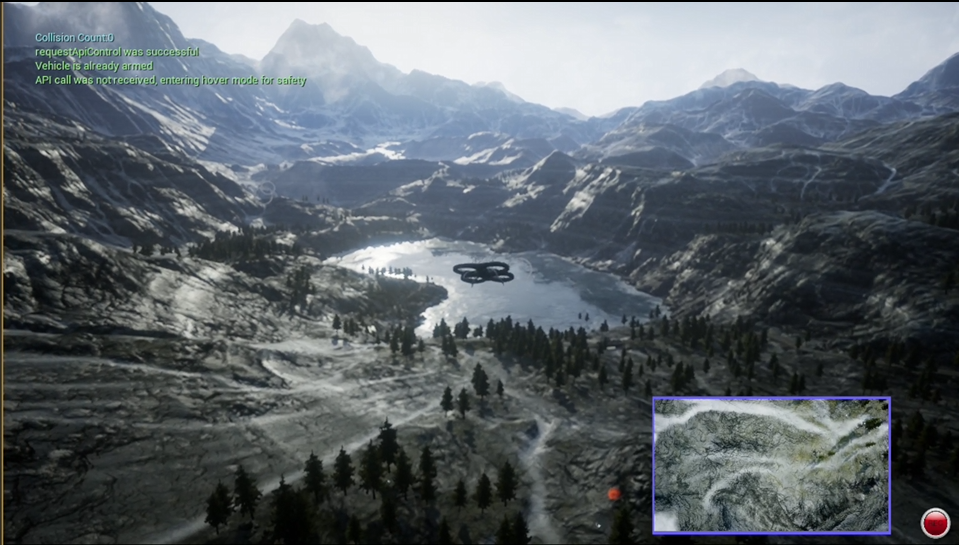
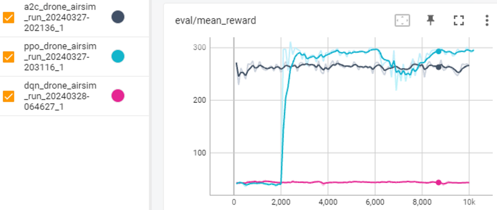

# A2D2: AI-driven Autonomous Drone-based Detection Network for Wildfires

## Description
A2D2 is an AI-driven Autonomous Drone-based Detection network system, aiming to fully automate the drone operational process for wildfire detection. 

## Process
The system is designed to fully automate 5-step operational process: 1) TakeOff, 2) Patrol, 3) Inspection, 4) Alert/Resume, and 5) Return

## Design
The system is driven by AI models and automated solutions, including:
- Deep computer vision (DCV) model for wildfire detection
- Coverage path planning (CPP) method managing patrol navigation
- Deep reinforcement learning (DRL) model controlling drone’s path towards the detected wildfires for inspection

## Models and Solutions
- Grid search optimization for drone altitude and camera tilt angle: Use a single fixed wildfire as the detection target,  repeatedly move the drone to different altitudes to test vision-based wildfire detection with different camera tilt angles from multiple locations at each altitude, and select the value set achieving the best wildfire detection accuracy at the highest altitude as the optimal parameters for the patrol stage flight. 
- Modified E-Spiral CPP Method: Outward Sprial spiral path starting from the center of the GCA and ending at the edge, with waypoints at the center of the GCCs along the spiral path.
- DCV Model: **YOLOv8**, DETR, EfficientDet, Faster R-CNN, RetinaNet
- DRL Model: Use sum of weighted bounding box size and weighted bounding box center offsets in x, y as reward function

## Tests

### Simulation Environment
- Simulator: [Microsoft AirSim](https://microsoft.github.io/AirSim/) (v1.8.1) in [Unreal Engine](https://www.unrealengine.com/) (v4.27.2)

- Scene/Content: [Landscape Mountains](https://www.unrealengine.com/marketplace/en-US/product/landscape-mountains) and [M5 VFX Vol2. Fire and Flames](https://www.unrealengine.com/marketplace/en-US/product/m5-vfx-vol2-fire-and-flames)

### Testing DCV models

Comparison of YOLOv8, DETR, EfficientDet, Faster R-CNN, RetinaNet models:

| Model | YOLOv8 | Faster R-CNN | DETR | EfficientDet | RetinaNet |
|------- | ------- | ------- | ------- | ------- | ------- |
| mAP5 | 0.913 | 0.916 | 0.748 | 0.663 | 0.763 |
| Description and Uniqueness | Single-shot with modified CSPDarknet | 53 with self-attention mechanism and feature pyramid network (FPN) | Two-shot with a region of interest (ROI) pooling layer and region proposal network (RPN) | Transformer on CNN backbone and feed-forward network (FFN) |  Single-shot with weighted bi-directional feature pyramid network (BiFPN) scaling method | Single-shot with focal loss function to address class imbalance during training |

### Testing DRL models

Comparison of DQN, A2C and PPO models:

### End-to-end Tests

Search 100 wildfires placed at random locations in the range of single-drone GCA from takeoff to alarms: 99% detection rate

## Contact
Email calvinyaozhou at gmail for any questions about this project.
