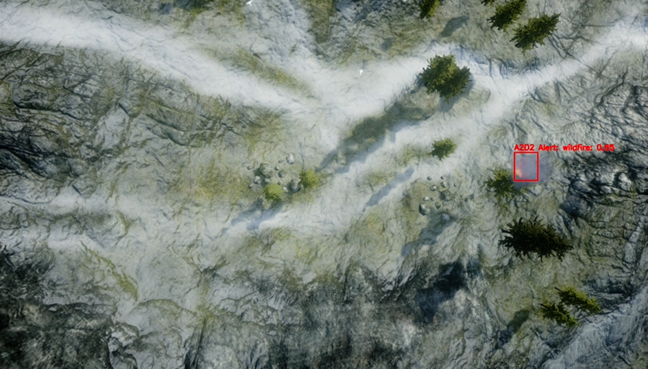

# A2D2: AI-driven Autonomous Drone-based Detection Network for Wildfires

## Description
A2D2 is an AI-driven Autonomous Drone-based Detection network system, aiming to fully automate the drone operational process for wildfire detection. The system integrates computer vision, path planning, and reinforcement learning to enable autonomous operation from takeoff through detection to landing.

### Motivation
- Early wildfire detection is crucial for preventing catastrophic spread
- Manual drone operations are labor-intensive and error-prone
- Need for fully autonomous systems that can operate 24/7
- Existing solutions lack full automation and intelligent decision-making

## System Overview

### Process Flow
The system is designed to fully automate 5-step operational process: 1) TakeOff, 2) Patrol, 3) Inspection, 4) Alert/Resume, and 5) Return

Each step serves a critical function:
- **TakeOff**: Autonomous initialization and ascent to patrol altitude
- **Patrol**: Systematic area coverage following optimized path planning
- **Inspection**: Close-range verification when potential wildfire detected
- **Alert/Resume**: Trigger alarm if confirmed, resume patrol if false positive
- **Return**: Autonomous return and landing sequence

### System Architecture
The system consists of several interconnected components:

Key components:
- **Patrol Path Planning Service**: Coverage path planning model
- **Wildfire Detection Service**: Deep computer vision model
- **Inspection Path Control**: Deep reinforcement learning model
- **Alert Service**: Multi-channel messaging
- **System Controller**: Orchestrates all components

## Simulation Platform
AirSim environment with mountainous terrain:

- Simulator: Microsoft AirSim v1.8.1
- Engine: Unreal Engine v4.27.2
- Assets: 
  - Landscape Mountains
  - M5 VFX Vol2. Fire and Flames

## Models and Solutions

### Grid Search Optimization
Use a single fixed wildfire as the detection target, repeatedly move the drone to different altitudes to test vision-based wildfire detection with different camera tilt angles from multiple locations at each altitude, and select the value set achieving the best wildfire detection accuracy at the highest altitude as the optimal parameters for the patrol stage flight.

Key aspects:
- Systematic testing of altitude-angle combinations
- Detection accuracy evaluation at each configuration
- Optimization for maximum detection range while maintaining accuracy
- Parameter selection for optimal patrol performance

### Coverage Path Planning
Modified E-Spiral CPP Method: Outward spiral path starting from the center of the GCA and ending at the edge, with waypoints at the center of the GCCs along the spiral path.
- Ground Coverage Area (GCA): Ground area that a single drone can patrol on a full charge
- Ground Coverage Cells (GCCs): Grid subdivisions, projection of the ground cell to a camera image 
- Coverage area optimized for drone capabilities and detection requirements

Features:
- Efficient area coverage with minimal path overlap
- Systematic progression from center to perimeter
- Strategic waypoint placement at GCC centers
- Optimized for single-drone operation

### Deep Computer Vision Model
Primary Models Evaluated:
- **YOLOv8**: Single-shot with modified CSPDarknet53 and self-attention mechanism
- **Faster R-CNN**: Two-shot with ROI pooling layer and region proposal network
- **DETR**: Transformer-based with CNN backbone and feed-forward network
- **EfficientDet**: Single-shot with weighted BiFPN scaling method
- **RetinaNet**: Single-shot with focal loss function for class imbalance

### Deep Reinforcement Learning Model
DRL implementation using sum of weighted bounding box size and weighted bounding box center offsets in x, y as reward function.

Key features:
- Optimized for inspection phase navigation
- Real-time decision making for path adjustments
- Balance between exploration and target tracking
- Continuous state-action space handling

## Tests

### Simulation Environment
- Simulator: [Microsoft AirSim](https://microsoft.github.io/AirSim/) (v1.8.1) in [Unreal Engine](https://www.unrealengine.com/) (v4.27.2)
- Scene/Content: [Landscape Mountains](https://www.unrealengine.com/marketplace/en-US/product/landscape-mountains) and [M5 VFX Vol2. Fire and Flames](https://www.unrealengine.com/marketplace/en-US/product/m5-vfx-vol2-fire-and-flames)

Example detection from simulation environment:

### Testing DCV models

Comparison of YOLOv8, DETR, EfficientDet, Faster R-CNN, RetinaNet models:

| Model | YOLOv8 | Faster R-CNN | DETR | EfficientDet | RetinaNet |
|------- | ------- | ------- | ------- | ------- | ------- |
| mAP5 | 0.913 | 0.916 | 0.748 | 0.663 | 0.763 |
| Description and Uniqueness | Single-shot with modified CSPDarknet53 with self-attention mechanism and feature pyramid network (FPN) | Two-shot with a region of interest (ROI) pooling layer and region proposal network (RPN) | Transformer on CNN backbone and feed-forward network (FFN) |  Single-shot with weighted bi-directional feature pyramid network (BiFPN) scaling method | Single-shot with focal loss function to address class imbalance during training |

### Testing DRL models

Comparison of DQN, A2C and PPO models:

### End-to-end Tests

System Performance:
- Search coverage: 100 wildfires at random locations
- Operation area: Single-drone GCA range
- Testing scope: Full operational cycle from takeoff to alarms
- Detection rate: 99% successful detection

## Implementation Details

### Requirements
- Python 3.8+
- AirSim 1.8.1
- Unreal Engine 4.27.2
- YOLOv8 dependencies
- PyTorch 1.9+

## Contact
Email calvinyaozhou at gmail for any questions about this project.

## License
This project is licensed under the MIT License - see the LICENSE file for details.
