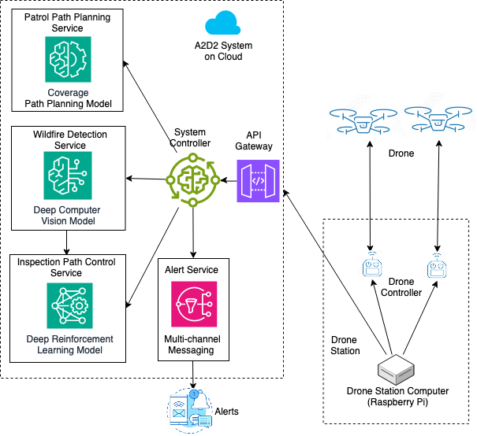

# A2D2: AI-driven Autonomous Drone-based Detection for Early-stage Wildfires using Deep Reinforcement Learning

## Goal
This project seeks to design and implement deep learning models to empower a drone to autonomously plan/control flight paths for searching and detecting early-stage wildfires. The final goal is to build an intelligent drone system to emulate the heuristic operational procedure of a human pilot, involving searching, flying over for confirmation, and navigating around for more detailed observation.

## Solution
Train a Deep Computer Vision model (DCV) for fire and smoke detection and use detection results as rewards to train a Deep Reinforcement Learning (DRL) model for real-time drone path planning and control.

## Test Environment
- Simulator: [Microsoft AirSim](https://microsoft.github.io/AirSim/) (v1.8.1) in [Unreal Engine](https://www.unrealengine.com/) (v4.27.2)

- Scene/Content: [Landscape Mountains](https://www.unrealengine.com/marketplace/en-US/product/landscape-mountains) and [M5 VFX Vol2. Fire and Flames](https://www.unrealengine.com/marketplace/en-US/product/m5-vfx-vol2-fire-and-flames)

## Implementation

### Deep Computer Vision (DCV) models for wildfire detection

YOLOv8, DETR, EfficientDet, Faster R-CNN, RetinaNet

| Model | YOLOv8 | Faster R-CNN | DETR | EfficientDet | RetinaNet |
|------- | ------- | ------- | ------- | ------- | ------- |
| mAP5 | 0.913 | 0.916 | 0.748 | 0.663 | 0.763 |
| Description and Uniqueness | Single-shot with modified CSPDarknet | 53 with self-attention mechanism and feature pyramid network (FPN) | Two-shot with a region of interest (ROI) pooling layer and region proposal network (RPN) | Transformer on CNN backbone and feed-forward network (FFN) |  Single-shot with weighted bi-directional feature pyramid network (BiFPN) scaling method | Single-shot with focal loss function to address class imbalance during training |

### Deep Reinforcement Learning (DRL) models for path planning 
Double Deep Q-Network (DDQN)  
Reward function: Wildfire detection confidence x100; Collision: -50; Episode stop: Reward > 80 or < 0.

## Contact
Email calvinyaozhou at gmail for any questions about this project.
